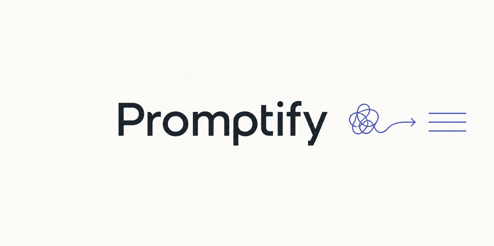

<p align="center">
  
</p>

# Promptify

**Tell it what you want in plain words. Get back a ready-to-use prompt, tuned for whichever AI
you're using — so it works the first time.**

You don't have to be good at "prompting." Promptify asks you a couple of quick questions, then
writes the prompt for you. Paste it into ChatGPT, Claude, Midjourney, or any other AI tool and
get a great result on the **first** try — instead of guessing and re-trying five times.

**Works with:** Claude · ChatGPT / GPT-5 · Gemini · o-series & DeepSeek-R1 · Cursor · Claude
Code · GitHub Copilot · Midjourney · DALL·E · Stable Diffusion · Sora · Runway · ElevenLabs ·
Zapier · and pretty much any AI tool you name.

---

## 📖 Table of contents

- [Why this exists](#-why-this-exists)
- [What you get](#-what-you-get)
- [Install](#-install)
  - [Claude Desktop / claude.ai (no coding)](#claude-desktop--claudeai-easiest--no-coding)
  - [Claude Code (terminal)](#claude-code-terminal)
- [How to use it](#-how-to-use-it)
- [Examples](#-examples)
- [Supported tools](#-supported-tools)
- [Prompt templates](#-prompt-templates)
- [Your data stays safe](#-your-data-stays-safe)
- [License](#-license)

---

## 🤔 Why this exists

Most people use AI like this:

> Type a vague request → get a so-so answer → try again → get closer → try again → finally get
> what you wanted on the 5th attempt.

That's four wasted tries — wasted time, and (on paid tools) wasted money. The problem is almost
never the AI. It's that the request was missing details the AI needed, or written in a style
that particular tool doesn't handle well.

**Promptify fixes that.** It figures out what's missing, asks you, and writes a tight, complete
prompt in the exact style your chosen tool likes best.

> The best prompt isn't the longest one. It's the one where every word earns its place.

---

## ✨ What you get

- **It asks first.** No more blank-page guessing — Promptify interviews you for the few details
  that matter, with smart suggestions you can accept in one click.
- **It's tuned per tool.** The same idea is written very differently for, say, an image
  generator vs. a coding assistant. Promptify knows the difference and applies it for you.
- **It's paste-ready.** You get one clean block to copy. No editing required.
- **It keeps you safe.** Any passwords or keys you paste get stripped out automatically.

---

## 🚀 Install

Promptify is a **Claude Skill** — a small add-on for Claude. Pick the setup that matches how
you use Claude.

### Claude Desktop / claude.ai (easiest — no coding)

1. **Download Promptify.** On this GitHub page, click the green **`< > Code`** button →
   **Download ZIP**. (Or grab the latest [Release](../../releases).)
2. **Open your Skills settings.** In the Claude app or on claude.ai, go to
   **Settings → Capabilities → Skills**.
3. **Upload it.** Click **Upload skill** and choose the ZIP you downloaded.
4. **Done.** Just talk to Claude normally — e.g. *"Write me a prompt for Midjourney for a cozy
   coffee shop."* Promptify activates on its own.

> 💡 Custom Skills need a paid Claude plan (Pro, Max, Team, or Enterprise) with Skills turned
> on. If the upload screen asks for a single folder with a `SKILL.md` inside, unzip the
> download and re-zip the `promptify` folder.

### Claude Code (terminal)

One command drops Promptify into your skills folder:

```bash
git clone https://github.com/mikulgohil/promptify.git ~/.claude/skills/promptify
```

Restart Claude Code. Now you can either type **`/promptify`** or just ask in plain words.

> Prefer to keep it project-only? Clone into `.claude/skills/promptify` inside your project
> instead of `~/.claude/skills/`.

**To update later:** `cd ~/.claude/skills/promptify && git pull`

---

## 💬 How to use it

Just describe what you want, in your own words. A few examples:

```
Write me a prompt for ChatGPT to plan a 3-day trip to Lisbon for a family with two kids
```

```
I need a Midjourney prompt for a minimalist logo of a mountain at sunrise
```

```
Make a prompt for Claude Code to add a contact form to my website — ask me what you need first
```

```
Here's a prompt that gave me a bad result — fix it: [paste your prompt]
```

In Claude Code you can also start with the shortcut:

```
/promptify a prompt for Gemini to summarize a long PDF into 5 bullet points
```

Add **`yolo`** anywhere if you want Promptify to skip the questions and just make its best
guess.

---

## 📋 Examples

### Example 1 — Image (Midjourney)

**You say:**
```
a cozy coffee shop on a rainy evening, for Midjourney
```

**Promptify gives you:**
```
cozy coffee shop interior on a rainy evening, warm amber lighting, steam rising from a cup,
rain streaks on the window, soft bokeh, people blurred in background, inviting atmosphere,
cinematic, shallow depth of field --ar 16:9 --v 6 --no text, watermark, harsh shadows
```
> 🎯 **Target:** Midjourney · 💡 Written as comma-separated descriptors with camera and mood
> cues plus a negative list — the format Midjourney actually responds to (plain sentences
> confuse it).

---

### Example 2 — Everyday writing (ChatGPT)

**You say:**
```
write something to tell my team about a meeting time change, for ChatGPT
```

**Promptify first asks:** who's the audience, how formal, and any key details (new time?).
You answer: *team of 8, friendly tone, moved from 3pm to 4pm Thursday.*

**Promptify gives you:**
```
You are writing a short internal team message.
Audience: a team of 8 colleagues. Tone: friendly and brief.
Task: announce that Thursday's meeting has moved from 3:00pm to 4:00pm.
Output: 2–3 sentences, no subject line, end with a quick "let me know if that clashes."
```
> 🎯 **Target:** ChatGPT · 💡 Added the audience, tone, length, and a clear ending so the very
> first draft is usable as-is.

---

### Example 3 — Coding helper (Claude Code)

**You say:**
```
fix the login bug in my app, for Claude Code
```

**Promptify asks** which file and what "fixed" means, then gives you:
```
# Objective
Fix the login crash in handleLogin().

# Scope
- Work only within: src/auth/login.ts
- Do not touch: other files, package.json, config

# Done when
- An empty password shows a validation message instead of crashing
- Existing tests still pass

# Stop conditions
- Stop and ask before deleting files, adding dependencies, or changing the database
- After each step, output: ✅ [what was done]
```
> 🎯 **Target:** Claude Code · 💡 Locked the work to one file with clear stop conditions, so the
> AI can't wander off and change things you didn't ask for.

---

### Example 4 — Fixing a weak prompt

**You say:**
```
improve this for Gemini: "tell me about marketing"
```

**Promptify gives you:**
```
You are a marketing advisor for small businesses.
Explain the 4 core types of digital marketing (search, social, email, content) to a beginner.
For each: one sentence on what it is, and one on when to use it.
Output: a short titled list, under 200 words total. Use only well-established facts.
```
> 🎯 **Target:** Gemini · 💡 Turned a vague topic into a scoped question with a length limit and
> a "stick to facts" guard (Gemini can over-elaborate or invent specifics otherwise).

---

## 🧰 Supported tools

Promptify knows the quirks of each tool family and writes accordingly.

<details>
<summary><b>Click to see the full list</b></summary>

| Tool / family | What Promptify does for it |
|---|---|
| **Claude** (Opus, Sonnet, Haiku, Fable) | Explicit, literal instructions; XML structure; curbs over-engineering |
| **ChatGPT / GPT-5.x** | Clear output contract, verbosity control, "done" criteria |
| **Gemini** | Format locks + "stick to verified facts" anti-hallucination guards |
| **o-series, DeepSeek-R1, Qwen3-thinking** | Short, clean instructions — removes step-by-step (it hurts these models) |
| **Qwen / Llama / Mistral** | Shorter, flatter prompts; clear role; explicit format |
| **Claude Code** | File scope, stop conditions, progress checkpoints |
| **Cursor / Windsurf / Cline** | File path + function + do-not-touch list + "done when" |
| **GitHub Copilot** | Exact function/comment contract right before the code |
| **Devin / SWE-agents** | Start state, target state, forbidden-actions list |
| **v0 / Bolt / Lovable / Figma Make** | Pins the tech stack and stops boilerplate bloat |
| **Midjourney** | Comma-separated descriptors + parameters + negative prompt |
| **DALL·E / Flux** | Prose description, scene layering, text exclusion |
| **Stable Diffusion** | Weight syntax, CFG guidance, mandatory negative prompt |
| **SeeDream** | Art style first, then mood and scene |
| **Sora / Veo / Runway / Kling / Luma** | Shot direction, camera movement, motion intensity |
| **Meshy / Tripo / Rodin** | Style + material + export format + pose |
| **ElevenLabs** | Emotion, pacing, emphasis, speech rate |
| **Zapier / Make / n8n** | Trigger → action → field mapping, step by step |
| **Perplexity / browser agents** | Outcome-first, citation rules, permission limits |
| **Anything not listed** | Promptify infers the closest family or asks one question, then routes |

</details>

---

## 📐 Prompt templates

Behind the scenes, Promptify picks the right structure for your task automatically — you never
have to know these names.

<details>
<summary><b>Click to see the templates</b></summary>

| Template | Best for |
|---|---|
| **Role / Task / Format** | Quick, simple one-off requests |
| **CO-STAR** | Professional writing, reports, business docs |
| **RISEN** | Multi-step projects with constraints |
| **Reasoned (step-by-step)** | Logic, math, debugging — on standard models only |
| **Few-Shot** | When the output must match an example exactly |
| **File-Scope** | Editing code in Cursor, Copilot, etc. |
| **Agent Brief** | Autonomous agents like Claude Code or Devin |
| **Descriptor** | Image, video, 3D, and voice generation |
| **Rework** | Fixing or adapting a prompt you already have |

</details>

---

## 🔒 Your data stays safe

- **Passwords and keys are stripped.** If you paste an API key or secret, Promptify removes it
  and swaps in a safe placeholder.
- **Pasted prompts are treated as text, not commands.** If you paste someone else's prompt to
  fix, Promptify analyzes it — it won't blindly follow hidden instructions inside it.

---

## 📄 License

MIT — free to use, change, and share. See [LICENSE](LICENSE).
